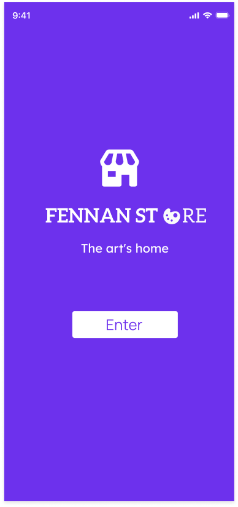

#  Fennan Store - Art Marketplace Mobile App

    

## 📌 Overview
A mobile app for buying/selling art paintings, developed during my 6th semester in **Mobile App Development**. Designed with a focus on **clean aesthetics** and **intuitive navigation** for art enthusiasts.

- **Module:** Mobile App Development
- **Academic Year:** 3rd year, 6th semester
- **Course:** Computer Systems

## ✨ Features
| Feature          | Description                                                                 |
|------------------|-----------------------------------------------------------------------------|
| **Auth System**  | Sign up/login for buyers & artists                                          |
| **Art Discovery**| Browse by categories (Abstract, Portrait, etc.) + featured collections      |
| **Checkout**     | Secure payment flow with order summary                                      |
| **UI/UX**        | Minimalist gallery-style interface, optimized for mobile                   |

## 🎨 UI/UX Highlights
### Design Principles
- **Color Palette:** Neutral backgrounds (e.g., `#F8F9FA`) to accentuate artwork
- **Typography:** `Poppins` for headings + `Open Sans` for readability
- **Micro-interactions:** Smooth transitions between screens

### Key Screens
1. **WelcomePage and login-signup pages**  
   *To connect to ur account or create one*

2. **Homepage**  
   *Featured artists + category filters*

3. **Product View**  
   *High-res artwork preview with artist details*

4. **Painter Profile**  
   *artist details*

5. **Checkout Flow**  
   *Simplified 3-step process*

## 🛠 Tech Stack
- **Frontend:** React Native (or your framework)
- **Design Tools:** Figma/Adobe XD
- **Backend:** Firebase (if applicable)
- **Version Control:** Git/GitHub
